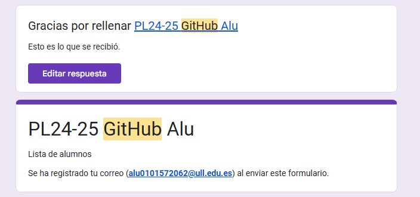
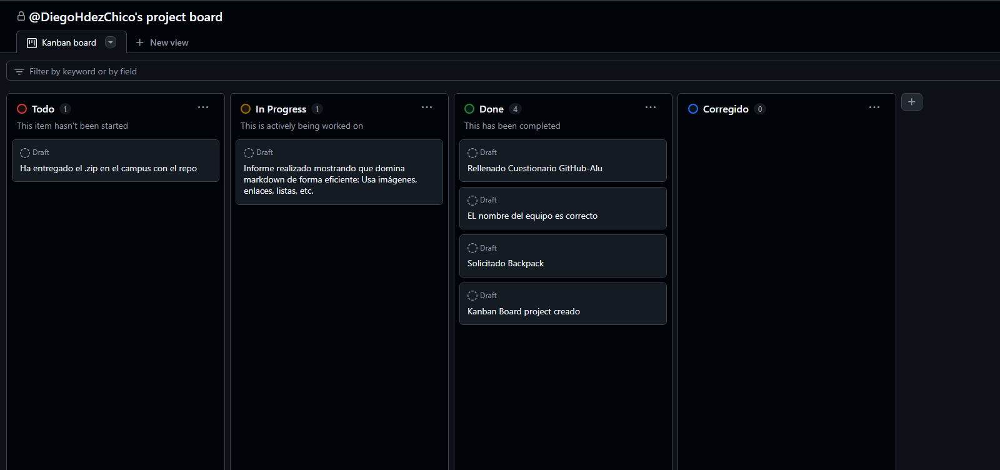
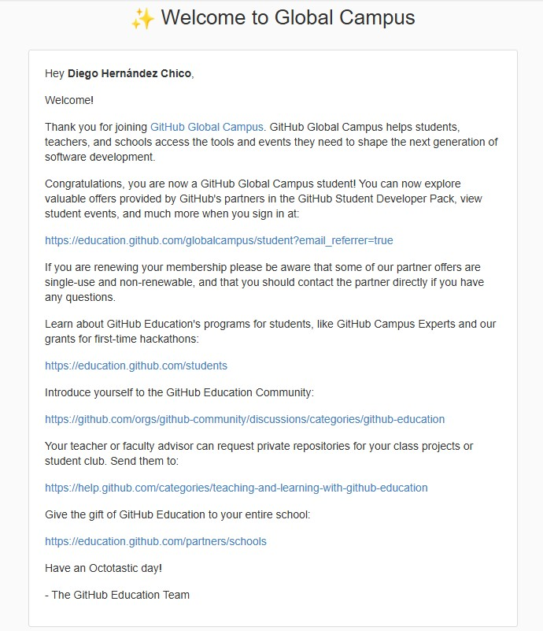

# Github Campus Expert 
## Práctica 1.
### Datos del autor:

* **Nombre**: Diego
* **Apellidos**: Hernández Chico
* **Identificador**: alu0101572062

## Rellenar el cuestionario GitHub-Alu del campus virtual y recibir el correo confirmándolo

## Crear equipo con nombre correcto

## Crear un project board kanban para este repositorio

## Solicitar el GitHub Backpack

